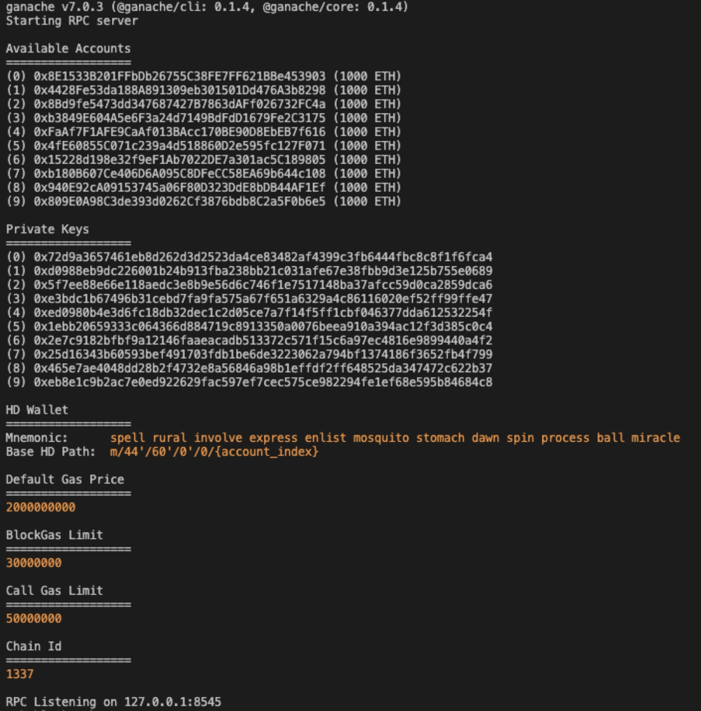

## Intended Audience

This manual is for carbon emission traders and market management operators.

## Getting Start

We denote the command to be entered on the terminal as: ! command

1. Requirements：

   | Component   | To install                           | Tested under the version |
   | ----------- | ------------------------------------ | ------------------------ |
   | node.js     | Download from https://nodejs.org/en/ | 16.15.0                  |
   | Truffle     | !npm install -g truffle              | 5.5.7                    |
   | Ganache-cli | !npm install -g ganache-cli          | 0.1.4                    |
   | MetaMask    | https://metamask.io/                 |                          |

2. Running Ganache-cli: ! ganache-cli

    

3. Open another terminal. Clone the repository via: ! git clone git@github.com:HarmoniaLeo/Decentralised-Carbon-Emissions-Trading-Platform

4. Go to the repository directory and install the Dapp: ! npm install

5. Make sure that RPC Listening on 127.0.0.1:8545. If not, open “truffle-config.js” and change the port

    

6. Migrate contract to the local chain: ! truffle migrate

    

   The contract will be compiled automatically. Two scripts will then be executed, and two transactions will be submitted. Then the DoubleAuction contract has been migrated to the local chain created by Ganache by Truffle. 

7. Open the GUI: ! npm run dev

8. Make sure you can use the MetaMask plugin on your browser. Once you have clicked on the MetaMask plugin, you may need to refresh your browser to make it available. 

9. Import accounts generated by Ganache to MetaMask.

    

   1. The user needs to at least import the “market account”, that is the first account in Ganache who deploys the contract and serves as the host of auctions, and at least 1 account as the buyer or seller. 

       

   2. To import account, using the Private Keys provided by Ganache. Copy them and place them into the corresponding input box of MetaMask. 

      

   3. After all accounts have been imported, refresh the page again and MetaMask will automatically jump to a new page where you can select accounts to connect to the site. 

       
## Usage

You can switch between accounts in MetaMask to become either buyers or sellers. However, only the first account in Ganache can be the market account. 

### For buyers

If you want to buy some carbon emission credits, you can scroll down the web page and look for the “Buyer Agent Interface” as follows.

 

At the beginning of each round of auction, you can enter your price and quantity in the “Price” and “Quantity” input boxes. After clicking on the “buyer bid” button, you will successfully participate in this auction. 

After the market clearing, your account will receive the refund by clicking on the “get refund” button.  

### For sellers

If you want to sell your carbon emission credits, you can scroll down the web page and look for the “Seller Agent Interface” as follows.

 

At the beginning of each round of auction, you can enter the price and quantity that you would like to sell in the “Price” and “Quantity” input boxes. After clicking on the “seller bid” button, you will successfully participate in this auction. 

After the market clearing, your account will receive the payment by clicking on the “get payment” button.

### For market management operators

During an auction, if you want to clear the market, you can scroll down the web page and look for the “Market Management Interface” as follows. 

 

Please click on “Market Clearing” button to clear the market. After the market is cleared, the information of the market will be displayed in the table which includes the clearing price, clearing quantity and clearing type of each auction.

You can clear everything when auctions finish and start a new round of auction by clicking the button “Clear All”.
